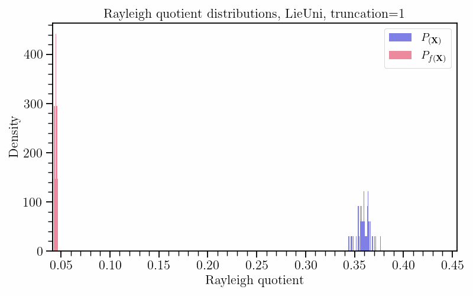

# Smoothness Discrepancies in Dynamics Models and How to Avoid Them

From [Edward Berman](https://ebrmn.space/) and [Luisa Li](https://www.luisali.com/). This project was done for [Robin Walters](https://www.robinwalters.com/) CS 7180 Special Topics Class on Geometric Structure in Deep Learning. Our report can be found [here](https://github.com/EdwardBerman/rayleigh_analysis/blob/main/paper/berman_li_cs_7180_report.pdf)

## Set Up Instructions

### General

1. This repository contains a submodule. To run this repository and access the submodules, run `git clone https://github.com/EdwardBerman/rayleigh_analysis.git ; git submodule add https://github.com/mitkotak/fast_flops.git ; git submodule add https://github.com/EdwardBerman/fourierflow` followed by `git submodule update --init --recursive`. The repo will require non Pythonic dependencies, you will need to run `sudo apt install cmake gfortran`.
2. Install poetry and run `poetry install`
3. Install wandb via and login via `wandb login [api key]`

For plotting, you might need to download additional tex support locally for the LaTeX strings.

### Simulated Heat diffusion on graphs

1. To generate the heat diffusion data on a graph, do: `python3 -m toy_heat_diffusion.heat_data --n_sources 20 --minheat 1 --maxheat 1  --num_graphs 10000 --size_mean 10 --size_std 2 --time_max 10 --time_step 0.5`. Alternatively, the dataset we generated is available on Zenodo for download at 

2. To train a GCN on the heat diffusion data on graph, do `python3 -m toy_heat_diffusion.train --data_dir toy_heat_diffusion/data --start_time 0.0 --train_steps 5 --eval_steps 2 --model gcn --layers 12 --hidden 128 --epochs 200 --entity_name [wandb entity name] --project_name [wandb project name]`
3. To train the equivalent(ish) Separable Unitary GCN on the heat diffusion data on graph, do `python3 -m toy_heat_diffusion.train --data_dir toy_heat_diffusion/data --start_time 0.0 --train_steps 5 --eval_steps 2 --model separable_unitary --layers 12 --hidden 128 --epochs 200 --entity_name [wandb entity name] --project_name [wandb project name]`. 
4. For Lie Unitary GCN, simply change the `--model` flag to `lie_unitary` and add the flag `--act Identity`. The bias and skip connections will be set to false by default to keep the model unitary.
5. In addition to wandb, you can reproduce our plots by running `python3 -m toy_heat_diffusion.eval --data_dir_GCN [path to saved GCN npy files after training] --data_dir_UNI [path to uni npy files] --save_dir [optionally specify savedir, ../assets by default]`

Note, you can either set the seed with the `--set_seed` flag or aggregate results across multiple runs.

### PDEs on Meshes

1. The heat and wave datasets can be generated by running `python3 -m external.custom_hermes.generate_heat` and `python3 -m external.custom_hermes.generate_wave`
2. Alternatively, we generated sample heat and wave data with default settings (i.e. what is in the submodule) and placed it in `data`
3. You can run training via `python3 -m external.custom_hermes.train dataset=heat backbone=hermes`, this is also in `shell_scripts/mesh/mesh.sh`. The wandb paths are specified in `external/custom_hermes/conf/train.yaml`
4. For Hermes, EMAN, and GemCNN, we use the default Checkpoints supplied from the original Hermes paper for evaluation.
5. For the Mesh Transformer and EGNN models, we have uploaded our own pretrained checkpoints in the `model_checkpoints` folder. You can run yourself using the same procedure as in #3 
6. Models are evaluated using `shell_scripts/mesh/eval_mesh.sh` or `python3 -m external.custom_hermes.eval_rollout dataset=heat backbone=hermes model_save_path=model_checkpoints/[model pt file]`

### Operators on Meshes and Grids 

0. The old submodule is the reason why there are so many different frameworks in our poetry environment. Don't blame me, [Blame Brett](https://open.spotify.com/track/6twjuBZfRJIZnoHrghzWLk?si=0af01ff951cb478b). To be fair, I am sure the authors of [this repository](https://github.com/alasdairtran/fourierflow/tree/main) are likely also blaming Brett.
1. I had to run the following to get the submodule to run outside of just installing the poetry environment: `poetry run python -m pip install --upgrade "jax[cuda12_pip]" -f https://storage.googleapis.com/jax-releases/jax_cuda_releases.html ; poetry run pip install "git+https://github.com/google/jax-cfd.git" ;  poetry run python -m pip install dask-cuda `
2. `export WANDB_MODE=online` for WANDB functionality to work
3. Instructions on loading the data are in `external/fourierflow`
4. To actually run training, you will go into the `external/fourierflow` directory and enter `python -m fourierflow.commands train --trial 0 experiments/[airfoil | elasticity | plasticity]/geo-fno/4_layers/config.yaml`
5. To visualize results run `python -m fourierflow.commands sample experiments/[airfoil | elasticity | plasticity]/geo-fno/4_layers/config.yaml` in the same directory as above

