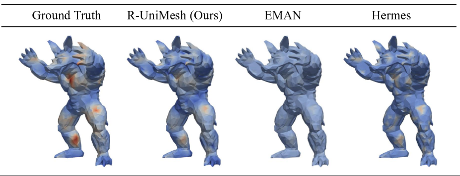

# Smoothness Errors in Dynamics Models and How to Avoid Them

From [Edward Berman\*](https://ebrmn.space/), [Luisa Li\*](https://www.luisali.com/), [Jung Yeon Park](https://jypark0.github.io/), and [Robin Walters](https://www.robinwalters.com/). Under Review at ICML 2026. A preprint is on arxiv [here](https://arxiv.org/abs/2602.05352). Set up instructions are below



## Set Up Instructions

### General

<details><summary>Details</summary>

1. This repository contains a submodule. To run this repository and access the submodules, run `git clone https://github.com/EdwardBerman/rayleigh_analysis.git ; git submodule add https://github.com/mitkotak/fast_flops.git ; git submodule add https://github.com/EdwardBerman/fourierflow ; git submodule add github.com/jypark0/hermes/` followed by `git submodule update --init --recursive`. All submodules should be in `external`.
2. The repo will require non Pythonic dependencies `cmake` and `gfortran`. On Ubuntu or PopOS! (my OS :D) you can run `sudo apt install cmake gfortran`. 
3. Install poetry and run `poetry install`
4. Install wandb via and login via `wandb login [api key]`

For plotting, you might need to download additional tex support locally for the LaTeX strings.

</details>

### Simulated Heat Diffusion on Grid Graphs

<details><summary>Details</summary>

**Generating Data**:
1. To generate the heat diffusion data on a graph, do: `python3 -m toy_heat_diffusion.heat_data --n_sources 20 --minheat 1 --maxheat 1  --num_graphs 10000 --size_mean 10 --size_std 2 --time_max 10 --time_step 0.5`. Alternatively, the dataset we generated is available on Zenodo for download at [](https://doi.org/10.5281/zenodo.17632910)

**Training**:
1. To train a GCN on the heat diffusion data on graph, do `python3 -m toy_heat_diffusion.train --data_dir toy_heat_diffusion/data --start_time 0.0 --train_steps 5 --eval_steps 2 --model gcn --layers 12 --hidden 128 --epochs 200 --entity_name [wandb entity name] --project_name [wandb project name]`
2. To train the equivalent(ish) Separable Unitary GCN on the heat diffusion data on graph, do `python3 -m toy_heat_diffusion.train --data_dir toy_heat_diffusion/data --start_time 0.0 --train_steps 5 --eval_steps 2 --model separable_unitary --layers 12 --hidden 128 --epochs 200 --entity_name [wandb entity name] --project_name [wandb project name]`. 
3. For Lie Unitary GCN, simply change the `--model` flag to `lie_unitary` and add the flag `--act Identity`. The bias and skip connections will be set to false by default to keep the model unitary.

Note, you can either set the seed with the `--set_seed` flag or aggregate results across multiple runs.

**Evaluation**:
1. In addition to wandb, you can reproduce our plots by running `python3 -m toy_heat_diffusion.eval --data_dir_GCN [path to saved GCN npy files after training] --data_dir_UNI [path to uni npy files] --save_dir [optionally specify savedir, ../assets by default]`


</details>

### PDEs on PyVista Meshes

<details><summary>Details</summary>

**Generating Data**:
1. The heat and wave datasets can be generated by running `python3 -m external.custom_hermes.generate_heat` and `python3 -m external.custom_hermes.generate_wave`
2. Alternatively, we generated sample heat and wave data with default settings (i.e. what is in the submodule) and placed it in `data`. The Cahn-Hilliard data can be similar found under `data`

**Training**:
1. You can run training via `python3 -m external.custom_hermes.train dataset=heat backbone=hermes`, this is also in `shell_scripts/mesh/mesh.sh`. The wandb paths are specified in `external/custom_hermes/conf/train.yaml`
2. For Hermes, EMAN, and GemCNN, we use the default Checkpoints supplied from the original Hermes paper for evaluation.
3. For the GCN, Uni Conv, Mesh Transformer, MPNN, and EGNN models, we have uploaded our own pretrained checkpoints in the `model_checkpoints` folder. You can run yourself using the same procedure as in #1

**Evaluation**:
1. Models are evaluated using `shell_scripts/mesh/eval_mesh.sh` or `python3 -m external.custom_hermes.eval_rollout dataset=[dataset] backbone=[backbone] model_save_path=model_checkpoints/[model pt file]`

</details>

### Weatherbench2

<details><summary>Details</summary>

We engineer the Weatherbench2 dataset and evaluation framework so that it is compatible with the rest of the evaluation framework used for the PDE data. You may need to run `pip install git+https://github.com/google-research/weatherbench2.git` in your Poetry environment

**Directory**:
- `data_preprocessing/weatherbench` contains the scripts used to download the ERAS5 data from Weatherbench2 and the code used to construct the mesh for the Earth. 
- `data/weatherbench` is where the downloaded datat will be saved. `data/weatherbench/climatology` should contain the climatology data. `data/weatherbench/eras5` should contain the ERAS5 data for the necessary time slice, and `data/weatherbench/earth_mesh.vtp` should be the file containing the Earth mesh. 
- `external/custom_hermes/dataset/weatherbench.py` contains the Weatherbench dataset. 
- `rollouts` will contain the rollout results after running the evaluation scripts. `weatherbench` will contain our own evaluation, and the zarr files used to run Weatherbench2 evaluation will be saved to `rollouts/{variable}/{level}`.
- `external/custom_hermes/eval_rollout_weatherbench.py` evaluates outputs with our evaluation framework, *and* saves the zarr files needed to run `eval_weatherbench.py`. 
- `external/custom_hermes/eval_weatherbench.py` evaluates forecasts with the provided evaluation framework. 

**Downloading data**:
1. Enter the `rayleigh_analysis` directory and then `mkdir data/weatherbench`
2. Download ERAS5 with `python3 -m data_preprocessing.weatherbench.download_era5s`
3. Download Climatology data with `python3 -m data_preprocessing.weatherbench.download_climatology`
4. Generate Earth mesh with  `python3 -m data_preprocessing.weatherbench.construct_earth_mesh`

**Training**:
1. Train with `python3 -m external.custom_hermes.train dataset=weatherbench backbone=[model]` as before
2. To store less in memory, `external/custom_hermes/conf/dataset/weatherbench.yaml` has `cluster` set to `False` by default, but the transformer requires cluster be set to True. We use `EGNN` for the PyVista meshes and `EGNN_Local` for Weatherbench2 due to memory constraints

**Evaluation**:
1. Evaluate with our metrics with `python3 -m external.custom_hermes.eval_rollout_weatherbench dataset=weatherbench backbone=[backbone] model_save_path=[model-checkpoint]`
2. The Weatherbench2 specific library causes problems, so we have our own environment for it. A requirements.txt for it is in our repo. We used a venv for this one: `python -m venv weatherbench2 ; source weatherbench2/bin/activate ; pip install -r requirements.txt`. This was done with python 3.13.5
3. Evaluate with Weatherbench2 specific metrics with `python3 -m external.custom_hermes.eval_weatherbench backbone=hermes`. See the detailed command line arguments at `external/custom_hermes/conf/eval_weatherbench.yaml`.
4. **[Extra]** A evaluation script that runs rollouts on ~1/10 of the test trajectories only can be found here: `external/custom_hermes/eval_rollout_weatherbench_toy.py`. It will run exactly the same as the above script but evaluates only a subset of the data for faster iteration.

**Further details**: 
- Training period: 2013-01-01 to 2019-12-31, testing period: 2020-01-01 to 2020-12-31
- Trained and evaluated on ERAS5 data, so model is non-operational 
- Evaluated on RMSE and ACC via the provided Weatherbench2 evaluation framework, and our own metrics for smoothness and correctness.
- Evaluate on two tasks, Z500 (geopotential at level=500) and T850 (temperature at level=850).
- 1.4 degree resolution (no regridding)
- 6 hour time steps
- To project data onto a mesh, we take each (lat, lon) pair to be a node, subdivide each cell into two triangles for triangulation. See exactly how the Earth mesh is constructed in `data_preprocessing/weatherbench/construct_earth_mesh.py`.

</details>

### Operators on Meshes and Grids 

<details><summary>Details</summary>

***Community Note: This analysis does not appear in the final paper, but was part of our internal analysis. You can find a write-up of our analysis*** [here](https://github.com/EdwardBerman/rayleigh_analysis/blob/main/paper/FNO.pdf)

**Preliminaries**:
1. The old submodule is the reason why there are so many different frameworks in our poetry environment. Don't blame me, [Blame Brett](https://open.spotify.com/track/6twjuBZfRJIZnoHrghzWLk?si=0af01ff951cb478b). To be fair, I am sure the authors of [this repository](https://github.com/alasdairtran/fourierflow/tree/main) are likely also blaming Brett.
2. I had to run the following to get the submodule to run outside of just installing the poetry environment: `poetry run python -m pip install --upgrade "jax[cuda12_pip]" -f https://storage.googleapis.com/jax-releases/jax_cuda_releases.html ; poetry run pip install "git+https://github.com/google/jax-cfd.git" ;  poetry run python -m pip install dask-cuda ; poetry run pip install gpytoolbox`
3. `export WANDB_MODE=online` for WANDB functionality to work

**Downloading Data**:
1. Instructions on loading the data are in `external/fourierflow`

**Training**:
1. To actually run training, you will go into the `external/fourierflow` directory and enter `python -m fourierflow.commands train --trial 0 experiments/[airfoil | elasticity | plasticity]/[geo-fno | ffno]/[num layers]_layers/config.yaml`. num layers can be one of `4, 8, 12, 16, 20, 24`

**Evaluation**:
1. To obtain results run `python -m fourierflow.commands sample experiments/[airfoil | elasticity | plasticity]/[geo-fno | ffno]/[num layers]_layers/config.yaml` in the same directory as above. The acceptable number of layers is again `4, 8, 12, 16, 20, 24`

</details>

### Long Range Graph Benchmark

<details><summary>Details</summary>

This didn't make into our final paper as the focused converged to dynamics modeling, but we have some support for it if you poke around :)

</details>

### Citation

Preprint:

```
@misc{berman2026smoothnesserrorsdynamicsmodels,
      title={Smoothness Errors in Dynamics Models and How to Avoid Them}, 
      author={Edward Berman and Luisa Li and Jung Yeon Park and Robin Walters},
      year={2026},
      eprint={2602.05352},
      archivePrefix={arXiv},
      primaryClass={cs.LG},
      url={https://arxiv.org/abs/2602.05352}, 
}
```

Workshop version:

```
@inproceedings{
berman2026smoothness,
title={Smoothness Errors in Dynamics Models and How to Avoid Them},
author={Edward Berman and Luisa Li and Jung Yeon Park and Robin Walters},
booktitle={AI{\&}PDE: ICLR 2026 Workshop on AI and Partial Differential Equations},
year={2026},
url={https://openreview.net/forum?id=ABtHGJV3ha}
}
```
